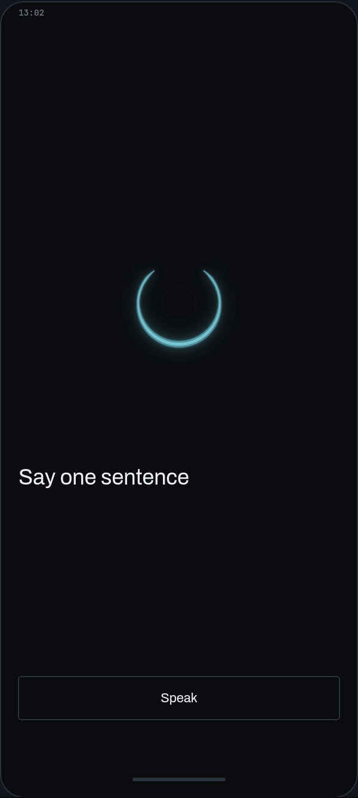
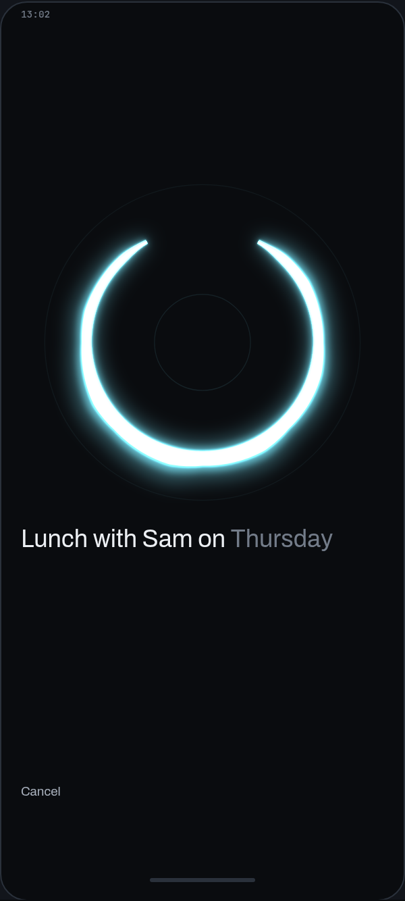
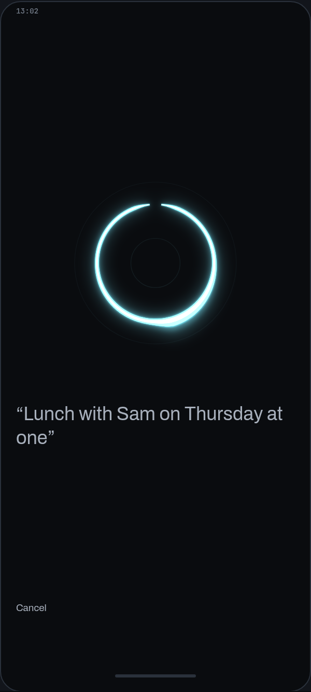
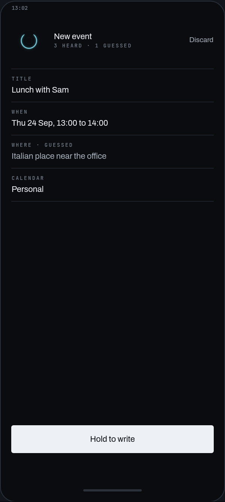
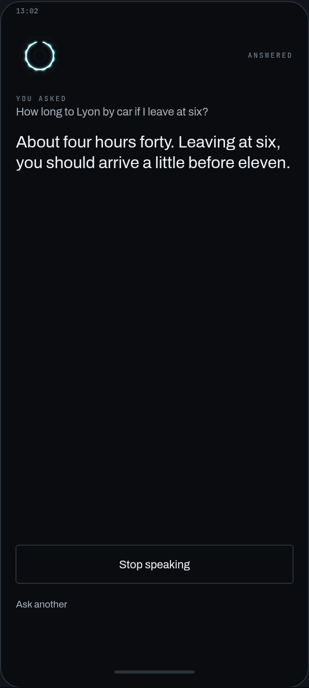
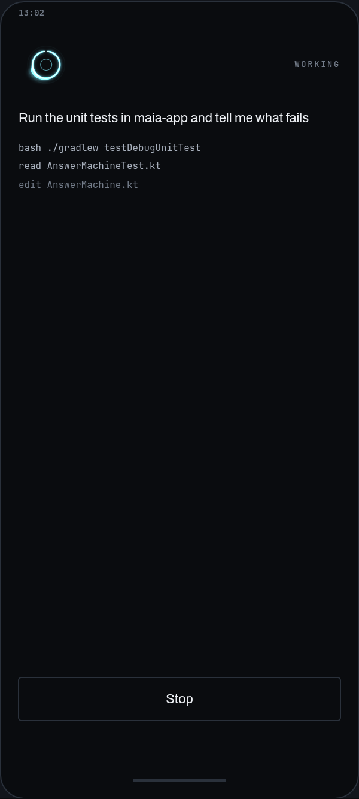

  

  

  Listening. The ring thickens where sound lands, so you can see it hear you before a word appears.

# Maia

Maia is a personal AI assistant that runs on hardware you own instead of someone else's cloud. It has two connected halves: a phone app that replaces Siri or Google Assistant, and a control panel for your own always-on machine (a computer at home, or a server you rent and administer yourself) that runs open AI models and does real work for you. Your voice, your notes, your calendar and your files stay on your own equipment. Nothing is handed to an outside company.

## What it does

**Run and supervise AI work on your own machine.** Most people who do serious work with open AI models keep one always-on computer for it, either at home or a rented server they fully control. Maia is the interface to that machine. You give AI agents tasks to run on it, watch what they are doing while they work, and see the results, without opening a terminal or being on the same network.

**Replace the voice assistant on your phone.** Maia's Android app is the thing you talk to instead of Siri or Google Assistant. It turns your speech into text using open speech recognition models running on the phone itself or on your own machine, never a cloud speech API. From there it does assistant work: taking notes, capturing reminders, adding and checking calendar events, answering questions.

## Screens

<table>
  <tr>
    <td align="center"> Idle</td>
    <td align="center"> Listening</td>
    <td align="center"> Thinking</td>
  </tr>
  <tr>
    <td align="center"> A new event, ready to write</td>
    <td align="center"> An answer</td>
    <td align="center"> An agent run on your machine</td>
  </tr>
</table>

Design renders of the app's screens, not device captures.

## Why local and open

Commercial assistants are closed products. The models are the vendor's, the processing happens on the vendor's servers, and the features are whatever the vendor decides to ship. That has two consequences you cannot fix from the outside: everything you say goes to a company you have no leverage over, and you cannot change how the assistant behaves.

Maia inverts both. The models are open weights you can swap. The processing happens on equipment you own. The behavior and the integrations are yours to modify, because nothing in the path belongs to anyone else.

## Status

Early. This repository holds the working code: the Android app (`maia-app/`), the tunnel that links the phone to your machine (`tunnel/` and `android/`), and the experiments that led there (`spike/`). Expect rough edges.
