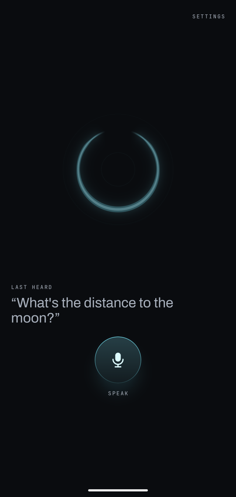
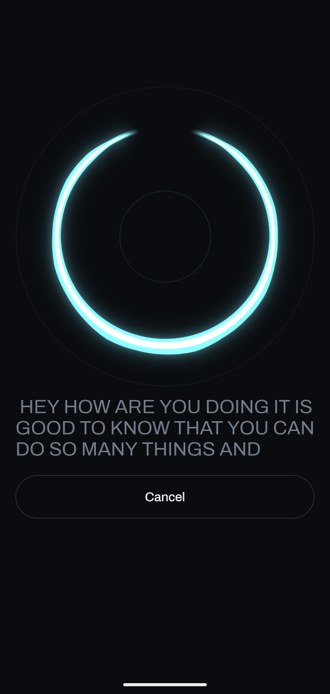
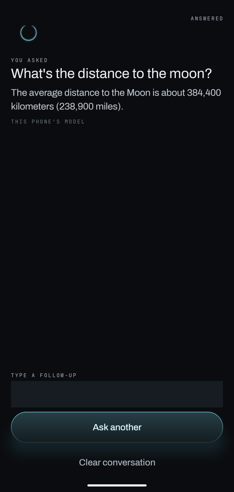

<p align="center">
  
</p>

<p align="center">
  
</p>

<p align="center">
  <sub>Listening. The ring thickens where sound lands, so you can see it hear you before a word appears.</sub>
</p>

# Maia

Maia is a personal AI assistant that runs on hardware you own instead of someone else's cloud. It has two connected halves: a phone app that replaces Siri or Google Assistant, and a control panel for your own always-on machine (a computer at home, or a server you rent and administer yourself) that runs open AI models and does real work for you. Your voice, your notes, your calendar and your files stay on your own equipment. Nothing is handed to an outside company.

## What it does

**Run and supervise AI work on your own machine.** Most people who do serious work with open AI models keep one always-on computer for it, either at home or a rented server they fully control. Maia is the interface to that machine. You give AI agents tasks to run on it, watch what they are doing while they work, and see the results, without opening a terminal or being on the same network.

**Replace the voice assistant on your phone.** Maia's Android app is the thing you talk to instead of Siri or Google Assistant. It turns your speech into text using open speech recognition models running on the phone itself or on your own machine, never a cloud speech API. From there it does assistant work: taking notes, capturing reminders, adding and checking calendar events, answering questions.

## Screens

<table>
  <tr>
    <td align="center"><br><sub>Waiting. Tap Speak, or use the assistant gesture.</sub></td>
    <td align="center"><br><sub>Listening. Your words appear as they are heard.</sub></td>
    <td align="center"><br><sub>An answer, from the model on the phone itself.</sub></td>
  </tr>
</table>

## Install with your coding agent

Maia is built from source for now. The quickest way is to hand the job to a coding agent (Claude Code, Codex, OpenCode or similar) running on a computer with your Android phone plugged in over USB. Copy the prompt below into it.

```text
Install Maia (https://github.com/YamineRL/Maia) on my Android phone, which is
plugged in over USB with USB debugging on.

1. Clone the repository and read maia-app/settings.gradle.kts and every
   maia-app/*/build.gradle.kts before doing anything else. They say which
   toolchain the build needs and which local .aar files it expects, and where.
2. Check my machine for what the build needs: JDK 21, the Android SDK with
   platform 36 and platform-tools (adb), and, for the tunnel library, Go and
   the Android NDK. Tell me what is missing and how you plan to install it
   before installing anything.
3. Fetch and build the native pieces the build does not fetch itself. Read
   each script before running it:
     maia-app/scripts/fetch-sherpa.sh   (speech recognition library)
     maia-app/scripts/fetch-litert.sh   (Pixel NPU support for the model)
     tunnel/scripts/build-aar.sh        (the tunnel library, needs Go,
                                         gomobile and the Android NDK)
4. From maia-app/, run the unit tests, then install a debug build:
     ./gradlew :app:testDebugUnitTest :app:installDebug
   Do not run connectedAndroidTest: it uninstalls the app and wipes its data.
5. The phone must be arm64 (the speech library ships only arm64-v8a). Check
   with: adb shell getprop ro.product.cpu.abi
6. The on-device answer model is optional and is not downloaded by the app.
   maia-app/scripts/provision-gemma.sh fetches it (about 3 GB) and pushes it
   to the phone. Ask me before running it. Also read the app source to find
   which speech recognition model files it needs and how they get onto the
   phone, and tell me before downloading any of them.
7. Tell me how to make Maia the phone's default digital assistant.

Stop and ask me whenever a step needs a decision, an account, or a large
download. Do not change code to get past an error; tell me what failed.
```

The part that runs on your own always-on machine (the agent control panel and the tunnel to the phone) is optional; the phone works on its own. Its pieces are in `tunnel/`.

## Why local and open

Commercial assistants are closed products. The models are the vendor's, the processing happens on the vendor's servers, and the features are whatever the vendor decides to ship. That has two consequences you cannot fix from the outside: everything you say goes to a company you have no leverage over, and you cannot change how the assistant behaves.

Maia inverts both. The models are open weights you can swap. The processing happens on equipment you own. The behavior and the integrations are yours to modify, because nothing in the path belongs to anyone else.

## Status

Early. This repository holds the working code: the Android app (`maia-app/`), the tunnel that links the phone to your machine (`tunnel/` and `android/`), and the experiments that led there (`spike/`). Expect rough edges.
